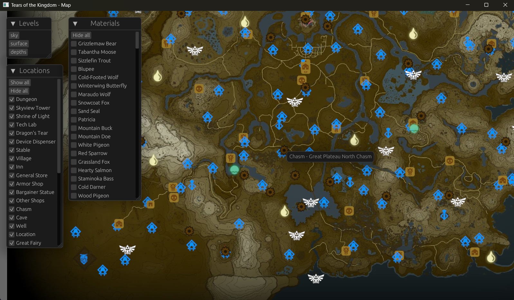

# Tears of the Kingdom - An Interactive Map

You can see it running [here](https://gaku-sei.github.io/totk-map/).

A simple and straightforward interactive map for Zelda Tears of the Kingdom.

Build in [Rust](https://www.rust-lang.org/) with [Bevy](https://bevyengine.org/).

## Screenshots

Desktop version:



Web version:


## Build and run

### Desktop (recommended)

After cloning this repository, you can simply use [Cargo](https://doc.rust-lang.org/cargo/):

```bash
cargo run --release
```

### Web version (not recommended)

In order to build (and run) the web based version:

```bash
python ./scripts/build_wasm.py
python ./scripts/run_wasm.py
```

You can now open [http://127.0.0.1:3000/](http://127.0.0.1:3000/) to access the map.
